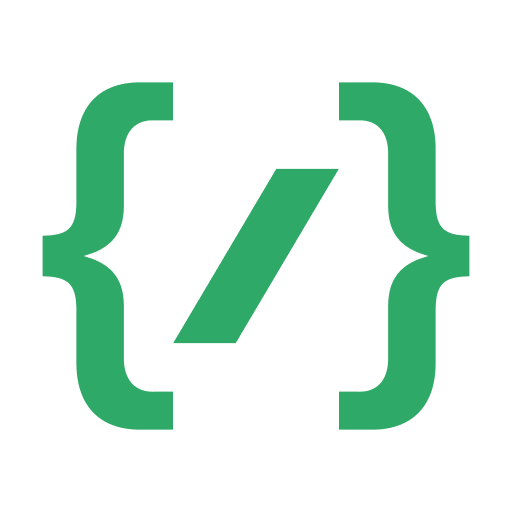

# Emblemas

Emblemas de usuário \
\
 Discord Staff\
 Discord Partnered Server Owner\
 Moderador Certified Discord\
 Discord HypeSquad Events\
 Discord HypeSquad House of Balance \
 Discord HypeSquad House of Brilliance\
 Discord HypeSquad House of Bravery\
 Discord Bug Hunter \
 Golden Bug Hunter\
 Discord Early Verified Bot Developer \
 Discord Early Supporter\
 Discord Nitro\
 Discord Server Boosting \
\
Emblemas de bot\
 Supports Commands
